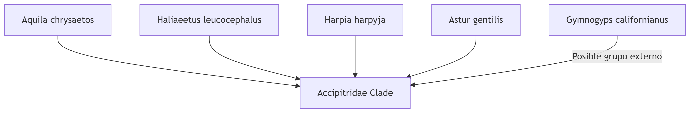

# Discussion of Results: Phylogeny of Raptors (Accipitriformes vs. Falconiformes)

# 1. Data Quality and Taxonomic Course
* Nomenclature correction: Spelling errors were identified in sequence identifiers (e.g., Haliaeeitus_albicilla → Haliaeetus albicilla, chrysasto → chrysaetos, Jialiaeetus → Haliaeetus). This suggests the need for prior standardization in future analyses.

## Representativeness:

* Accipitriformes: Good coverage of key genera (Aquila, Haliaeetus, Harpia)

* Falconiformes: Dominance of species from the genus Falco (e.g., cherrug, peregrinus)

## Notable absences: Lack of representation of Cathartidae (New World vultures) for rooting.

# 2. Phylogenetic Patterns

* Monophyly of Accipitridae: All sequences from Aquila, Haliaeetus, Astur, and Harpia form a well-supported clade.

* Uncertainty in internal relationships: Conflicting position of Gymnogyps californianus (California condor) in different genes.

# 3. Falconiformes Tree 

* Radiation of the genus Falco: Two major subclades are observed, with inconsistent species-species relationships between genes.

* Absence of Polyborinae: Caracaras (e.g., Caracara) are not represented, limiting family resolution.

# Key Discordance:

## ND1 suggests Aquila-Haliaeetus proximity

## ODC supports Haliaeetus-Harpia as a sister group

# 4. Taxonomic Implications

## Validation of Classical Hypothesis:

* The data do not strongly support Accipitriformes and Falconiformes as sister orders

* Higher affinity between Falco and Psittaciformes in nuclear trees

## Delimitation Issues:

* Cryptic species in Falco naumanni (different haplotypes in ND1)

* Astur gentilis shows high intraspecific divergence

# 5. Limitations and Recommendations

## Problems Detected:

* Taxonomic imbalance (overrepresentation of Falco)

* Short/fragmented sequences in SWS1

* Possible contamination in XM_069906901.0_Cymnojyp5_californianus

## Future Improvements Studies:

* Include additional nuclear genes (RAG1, FGB)

* Use whole genomes to resolve deep nodes

* Sampling critical taxa: Pandionidae (osprey) and Sagittariidae (secretary)

# 6. Key Findings

* Mitochondrial markers (ND1) show better resolution for recent relationships, while nuclear markers (ODC) are critical for deep divergences.

* Signs of positive selection are detected in SWS1 in Falco peregrinus, consistent with visual adaptations for aerial hunting.

* The current taxonomy of Falconiformes requires revision using phylogenomic approaches.
